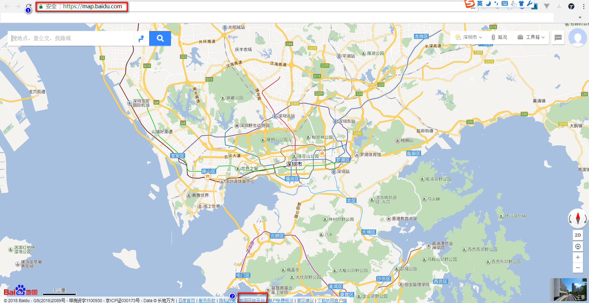

### 基于ElasticSearch全局搜索项目实战

#### 1.需求说明
> 待补充

* ES相关知识的更多资料了解，请移步参考[ES 学习系列摘记](./doc/es-learn/00.Elasticsearch%20a%20学习系列笔记.md)
#### 2.数据库设计
（略）

#### 3.项目工程结构


#### 4.开发细节
* 视图解析器的配置
    ```java
    /**
       * <pre>静态资源配置</pre>
       *
       * @param registry
       */
      @Override
      public void addResourceHandlers(ResourceHandlerRegistry registry) {
        registry.addResourceHandler("/static/**")
                .addResourceLocations("classpath:/static/");
      }
    
      /**
       * 模板资源解释器
       *
       * @return
       */
      @Bean
      @ConfigurationProperties(prefix = "spring.thymeleaf")
      public SpringResourceTemplateResolver templateResolver() {
        SpringResourceTemplateResolver templateResolver = new SpringResourceTemplateResolver();
        templateResolver.setApplicationContext(this.applicationContext);
        templateResolver.setCharacterEncoding("UTF-8");
        templateResolver.setCacheable(this.thymeleafCacheEnable);
        return templateResolver;
      }
    
      /**
       * Thymeleaf标准方言解释器
       *
       * @return
       */
      @Bean
      public SpringTemplateEngine templateEngine() {
        SpringTemplateEngine templateEngine = new SpringTemplateEngine();
        templateEngine.setTemplateResolver(templateResolver());
        /** 支持Spring EL表达式 **/
        templateEngine.setEnableSpringELCompiler(true);
        /** 支持SpringSecurity方言 **/
        SpringSecurityDialect securityDialect = new SpringSecurityDialect();
        templateEngine.addDialect(securityDialect);
        return templateEngine;
      }
    
      /**
       * Thymeleaf视图解释器
       *
       * @return
       */
      @Bean
      public ThymeleafViewResolver viewResolver() {
        ThymeleafViewResolver viewResolver = new ThymeleafViewResolver();
        viewResolver.setTemplateEngine(templateEngine());
        return viewResolver;
      }
    ```

* 返回信息的统一处理
>TODO
    
* 文件上传
    * 002.DispatcherServlet中的解释
    
    * 003.MultipartResolver流程梳理
    
    * 004.文件上传代码和配置
    

* 分布式session实现
    * 1.maven 依赖
        ```xml
        <!-- redis session依赖 -->
        <dependency>
            <groupId>org.springframework.session</groupId>
            <artifactId>spring-session</artifactId>
        </dependency>
    
        <dependency>
            <groupId>org.springframework.boot</groupId>
            <artifactId>spring-boot-starter-data-redis</artifactId>
        </dependency>
        ```
    * 2.配置信息
        ```properties
        #session(存储方式)
        spring.session.store-type=redis
        # redis config
        spring.redis.database=0
        spring.redis.host=127.0.0.1
        spring.redis.port=6379
        spring.redis.pool.min-idle=1
        spring.redis.timeout=3000
        ```
    * 3.代码实现
        ```java
        package com.rainbow.house.search.config;
        
        import org.springframework.context.annotation.Bean;
        import org.springframework.context.annotation.Configuration;
        import org.springframework.data.redis.connection.RedisConnectionFactory;
        import org.springframework.data.redis.core.RedisTemplate;
        import org.springframework.data.redis.core.StringRedisTemplate;
        import org.springframework.session.data.redis.config.annotation.web.http.EnableRedisHttpSession;
        
        /**
         * <p>功能描述</br></p>
         *
         * @author jiangy19
         * @version v1.0
         * @projectName rainbow-search
         * @date 2018/6/1 9:07
         */
        @Configuration
        @EnableRedisHttpSession(maxInactiveIntervalInSeconds = 86400)
        public class RedisSessionConfig {
        
          @Bean
          public RedisTemplate<String, String> redisTemplate(RedisConnectionFactory factory) {
            return new StringRedisTemplate(factory);
          }
        }
    
        ```

* ES的安装和配置
    * 1.安装和启动ES(详细请参考各种文档)
        * 
        * 
        * 安装和配置步骤(略)
    
    * 2.启动head插件
    
    
    * 3.访问http://localhost:9100
    

    * 4.项目中使用Elasticsearch
        ```properties
        #Es Config
        elasticsearch.cluster.name=JhonRain
        elasticsearch.host=127.0.0.1
        elasticsearch.port=9300
        ```
    
* 索引的构建
    * 1.索引结构定义(json格式)
        - [使用默认的分词器（standard）](./doc/index/house_index_mapping.json)
        - 

    * 2.RestfulAPI 创建索引
        - 2.1.创建索引
        - 
        - 2.2.查看索引结构
        - 
        - 2.3.单元测试
        - 
        - 2.4.ES配置信息
        - 
        
    * 3.定义索引结构模板
        - 略
        
    * 4.Es索引操作Restful API 使用
        * 
        * 
        * 
        * 
        * 
        * 
        * 
        * 
        * 
        * 
        
    * 5.IK-Analysis插件的安装
        * 

* Kafka的环境配置【windows】（使用Kafka来异步创建和更新索引）
    * 1.下载kafka
        * Apache官网
        
    * 2.修改zookeeper的配置文件
        * 存放log日志的地方
        * 
        
    * 3.修改kafka的配置文件
        * 存放log日志的地方
        * 
        * 定义消费者的groupid
        * 
        * 详细可参考此文：[window搭建kafka](https://blog.csdn.net/qq_32485573/article/details/54562237?locationNum=5&fps=1)
    * 4.项目中使用kafka
        ```properties
        # kafka
        spring.kafka.bootstrap-servers=127.0.0.1:9092
        spring.kafka.consumer.group-id=rainbow-search
        ```
    * 启动命令
        * zookeeper
            ```bash
            D:\RAIN-MQ\kafka_2.11-1.1.0>bin\windows\zookeeper-server-start.bat config\zookeeper.properties
            ```
        * kafka
            ```bash
            D:\RAIN-MQ\kafka_2.11-1.1.0>bin\windows\kafka-server-start.bat config\server.properties
            ```
* 百度地图的集成
    * 百度地图的开放平台
    
    
    
    * 虎鲸数据平台(http://lbsyun.baidu.com/data/)
    
    
    
    
    
    
    * ES索引重构(加上地理位置的索引结构)
    [使用默认的分词器（standard）](./doc/index/house_index_with_perfect_config.json)
#### 5.单元测试
* 测试基类的配置
    ```java
    package com.rainbow.house.search;
    
    import org.junit.runner.RunWith;
    import org.springframework.boot.test.context.SpringBootTest;
    import org.springframework.test.context.ActiveProfiles;
    import org.springframework.test.context.junit4.SpringRunner;
    
    @RunWith(SpringRunner.class)
    @SpringBootTest
    @ActiveProfiles(value = "test")
    public class RainbowSearchApplicationTests {
    
    }
    
    ```
* 测试类（用户测试类）
    ```java
    package com.rainbow.house.search.entity;
    
    import com.rainbow.house.search.RainbowSearchApplicationTests;
    import com.rainbow.house.search.repository.UserRepository;
    import org.junit.Assert;
    import org.junit.Test;
    import org.springframework.beans.factory.annotation.Autowired;
    
    /**
     * <p>功能描述</br>用户测试类</p>
     *
     * @author jiangy19
     * @version v1.0
     * @projectName rainbow-search
     * @date 2018/5/30 11:50
     */
    public class UserRepositoryTest extends RainbowSearchApplicationTests {
    
      @Autowired
      private UserRepository userRepository;
    
      @Test
      public void queryUserTest() {
        UserDO user = userRepository.findOne(1L);
        Assert.assertEquals(user.getName(),"jhonrain");
      }
    }
    ```

* 测试类（ES）
    ```java
    package com.rainbow.house.search.service.search;
    
    import com.rainbow.house.search.RainbowSearchApplicationTests;
    import com.rainbow.house.search.base.ServiceMultiResult;
    import com.rainbow.house.search.base.rent.RentSearchCondition;
    import com.rainbow.house.search.service.EsSearchService;
    import org.junit.Assert;
    import org.junit.Test;
    import org.springframework.beans.factory.annotation.Autowired;
    
    /**
     * <p>功能描述</br>Es的测试类</p>
     *
     * @author jiangy19
     * @version v1.0
     * @projectName rainbow-search
     * @date 2018/6/2 14:46
     */
    public class EsServiceTest extends RainbowSearchApplicationTests {
    
      @Autowired
      private EsSearchService esSearchService;
    
      @Test
      public void indexTest() {
        Long houseId = 16L;
        esSearchService.indexVersionOne(houseId);
      }
    
      @Test
      public void removeIndexTest() {
        Long houseId = 16L;
        esSearchService.removeVersionOne(houseId);
      }
    
      @Test
      public void query() {
        RentSearchCondition rentSearchCondition = new RentSearchCondition();
        rentSearchCondition.setCityEnName("bj");
        rentSearchCondition.setStart(0);
        rentSearchCondition.setSize(10);
        ServiceMultiResult<Long> houseIds = esSearchService.query(rentSearchCondition);
        System.out.print(houseIds.getResults());
        Assert.assertEquals(2, houseIds.getTotal());
      }
    }
    
    ```

#### 6.结束语

