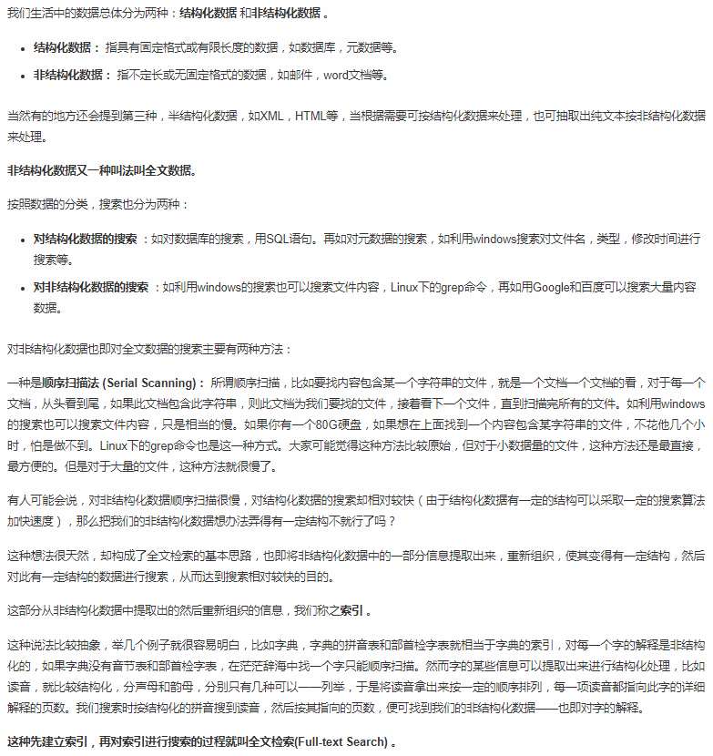
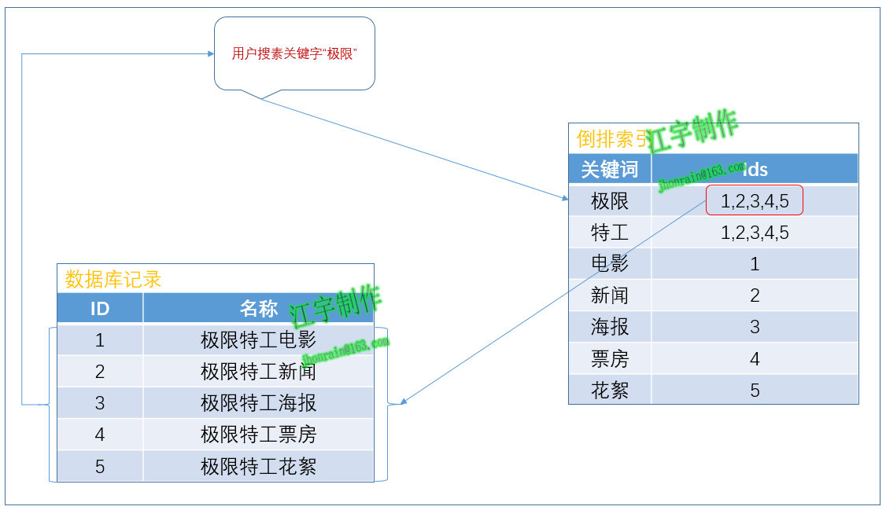
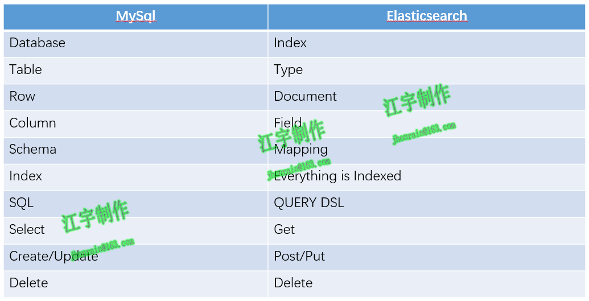

### ES基础知识

* 全文检索(Full-text Search)
> 先建立索引，再对索引进行搜索的过程就叫全文检索(Full-text Search) 

* 全文检索大体分两个过程，索引创建 (Indexing) 和搜索索引 (Search) 
    * 索引创建：将现实世界中所有的结构化和非结构化数据提取信息，创建索引的过程。
    * 搜索索引：就是得到用户的查询请求，搜索创建的索引，然后返回结果的过程。
        
* Lucene

* 倒排索引(Inverted Index)：
　　ElasticSearch引擎把文档数据写入到倒排索引（Inverted Index）的数据结构中，倒排索引建立的是分词（Term）和文档（Document）之间的映射关系，
在倒排索引中，数据是面向词（Term）而不是面向文档的。

* Elasticsearch：
    * 1.分布式搜索引擎&数据分析引擎
    
    * 2.全文检索，结构化检索，数据分析
    
    * 3.对海量数据进行近实时的处理
    
* ES中相关核心概念：
    * Node(节点)：单个安装了ES服务并且能够提供故障转移和扩展的服务器;
    * Cluster(集群)：一个集群就是由一个或多个Node组织在一起，共同工作;
    * Shards(分片):ES将索引分成若干份，每个部分就是一个shard;
    * Replicas(复制)：Replicas是索引一份或者多份拷贝;
    * Index(索引)：索引就是一个拥有几份相似特性的文档的集合;
    * Type(类型)：一个索引中可以定义一种或者多种类型;
    * Document(文档)：一个文旦是一个可被检索的基础信息单元;
    * Field(字段)：Field是ES中的最小单位，相当于数据的某一列;
    
* MySQL和Elasticsearch的对比：
