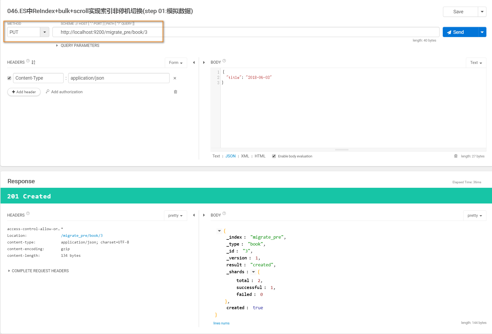
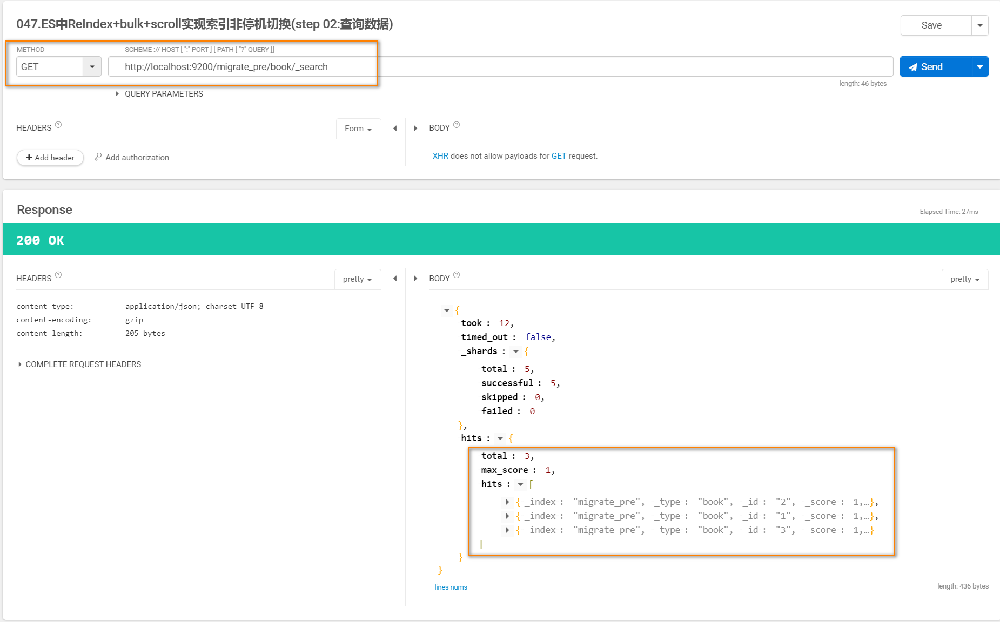
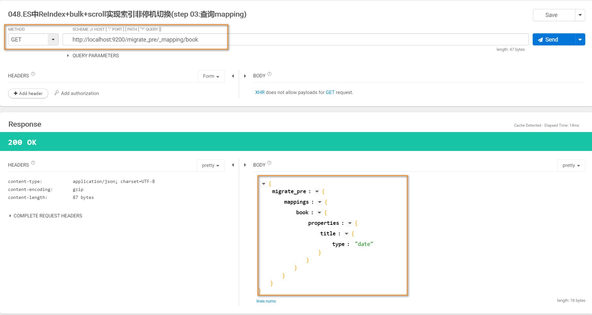
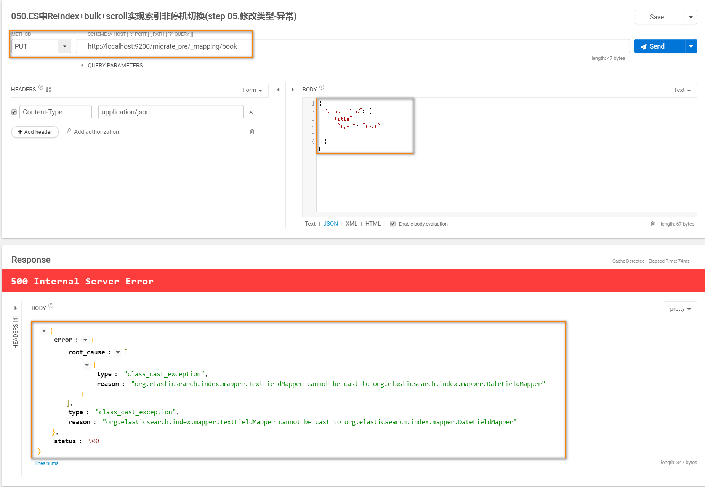
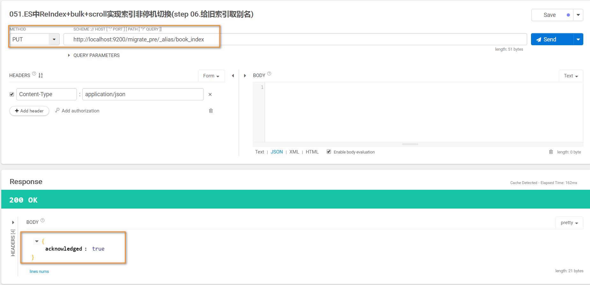
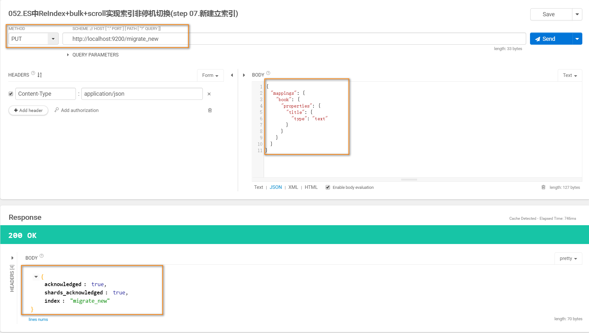
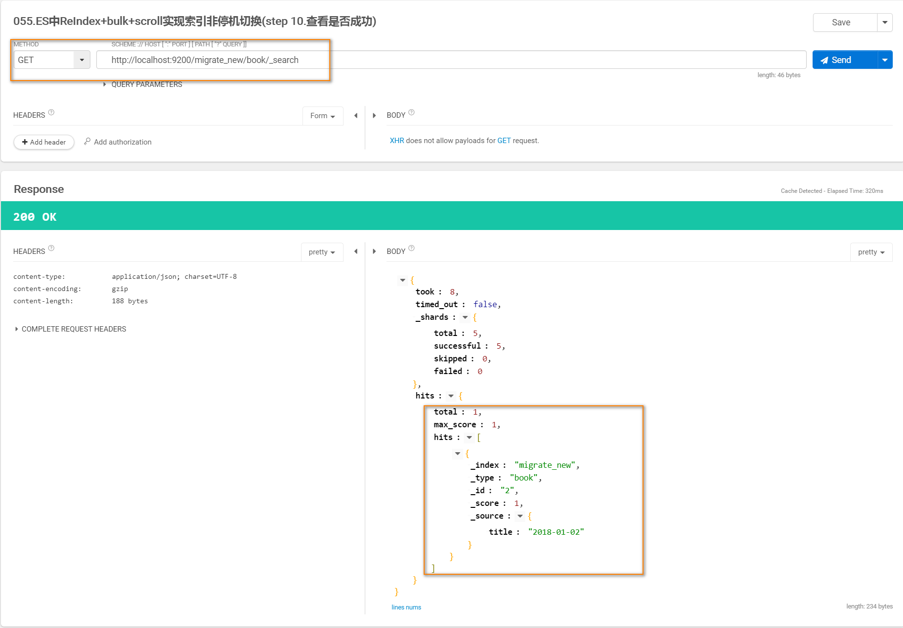
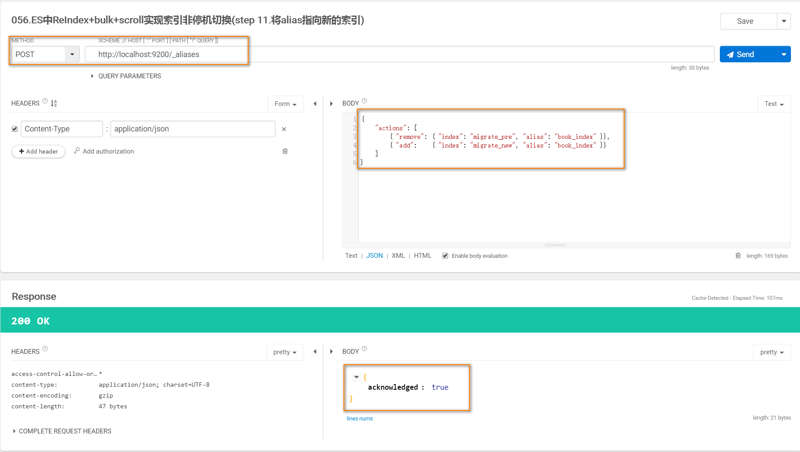
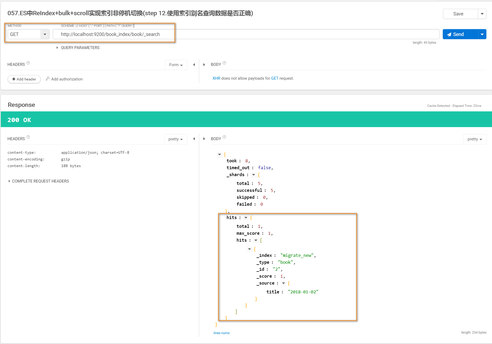

### Elasticsearch中不停机实现索引迁移重建
* 01创建索引

* 02查看索引

* 03查看mapping

* 04插入string类型报错

* 05修改类型--异常

* 06给旧索引取别名

* 07新建立索引

* 08使用scroll%20api将数据查询出来

* 09使用bulk%20api将数据导入到新的索引中

* 10查看数据是否导入成功

* 11将索引别名重新指向新的索引

* 12数据的校验
