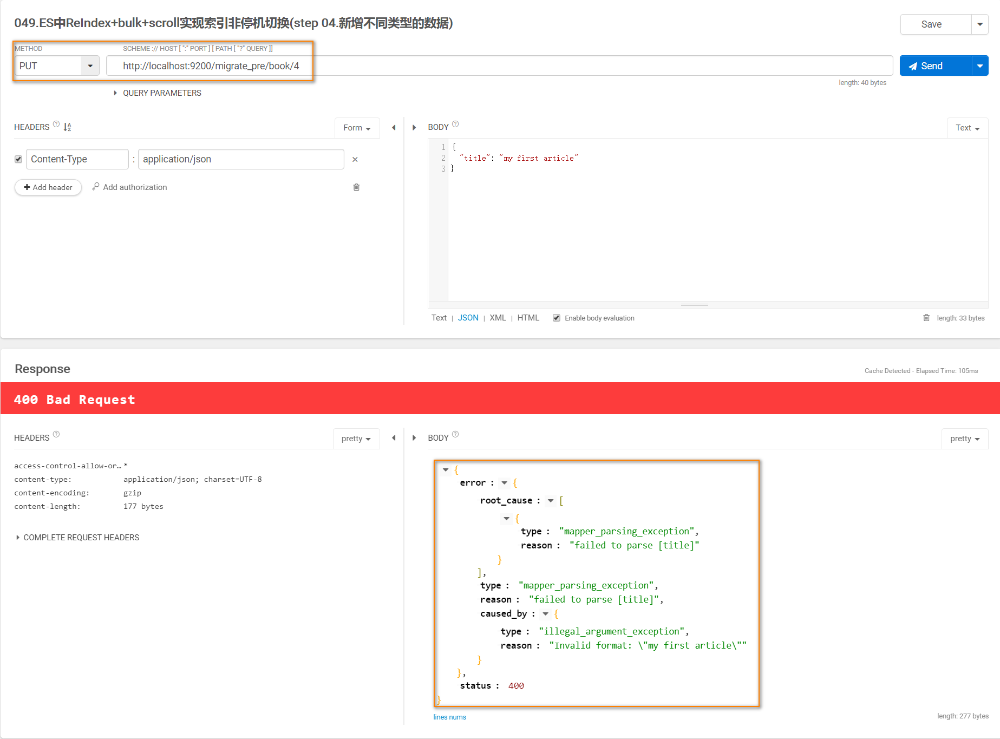

### Elasticsearch中不停机实现索引迁移重建

#### 重建索引的原则
>　　当一个索引已经被建立好后，其中任何一个field的设置是不能通过api进行修改的，如果要修改一个Field，那么应该重新按照mapping,建立一个新的index,
然后将原来建立好的索引中将数据批量查询出来（批量查询的时候，建议采用scroll api,并且采用多线程办法的方式来ReIndex数据，每次scroll就查询指定日期
的一段数据，然后交给一个线程去处理），使用bulk api将数据重新写入到新建立的索引中。

#### 实际案例演示

* 01创建索引
　　首先，使用dynamic mapping，插入数据，但是发现有些数据是日期格式的，而实际上title是string类型的，所以ES在dynamic mapping的时候，就默认将
title这种Field自动映射为date类型了。
    

* 02查看索引 --> 查看索引结构，如下图所示：
    

* 03查看mapping
    查看索引的mapping结构，发现title字段的类型为date类型

* 04插入string类型报错--类型不匹配

* 05修改类型--异常详情

* 06给旧索引取别名
> 如果说旧索引的名字，是old_index，新索引的名字是new_index，终端java应用，已经在使用old_index在操作了，难道还要去停止java应用，修改使用
的index为new_index，才重新启动java应用吗？这个过程中，就会导致java应用停机，可用性降低。所以，给java应用一个别名，这个别名是指向旧索引的，
java应用先用着，java应用先用book_index alias来操作，此时实际指向的是旧的book_index。

* 07新建立索引

* 08使用scroll api将数据查询出来

* 09使用bulk api将数据导入到新的索引中

* 10查看数据是否导入成功

* 11将索引别名重新指向新的索引

* 12数据的校验
