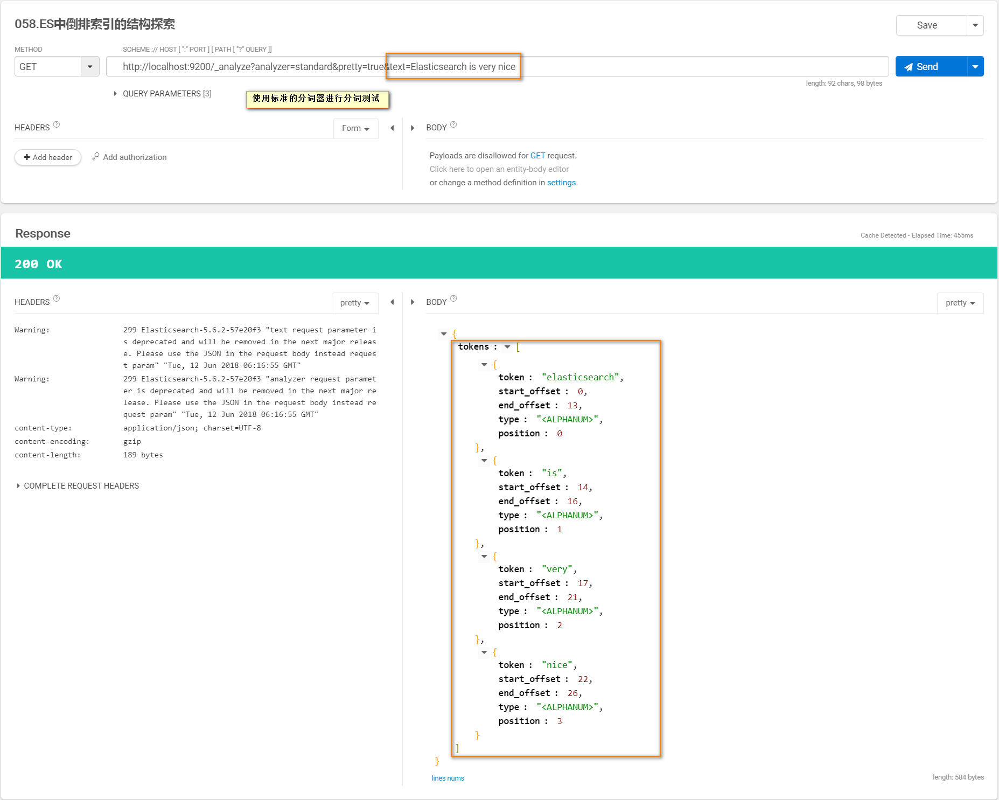

### Elasticsearch中倒排索引（Inverse Index）的组成结构

* 倒排索引的结构
    * 包含这个关键词的document list
    * 包含这个关键词的所有document的数量：IDF(Inverse Document Frequency)
    * 这个关键词在每个document中出现的次数：TF(Term Frequency)
    * 这个关键词在这个document的长度：length norm
    * 包含这个关键词的所有document的平均长度
    
* 倒排索引不可变的优缺点
    * 优点：
        * 不需要使用锁，提升并发能力，避免锁的问题
        * 数据不变，一直保存在os cache中，只要cache内存足够
        * filter cache 一直驻留内存，因为数据不变
        * 可以压缩，节省cpu和io开销
    * 缺点：
        每次都需要重新构建整个索引
        
* ES标准的分词器使用
