### Elasticsearch Restful API
* 1.查询ES的健康状况
> Type：GET

> URL：http://localhost:9200/_cat/health?v
```json
无
```
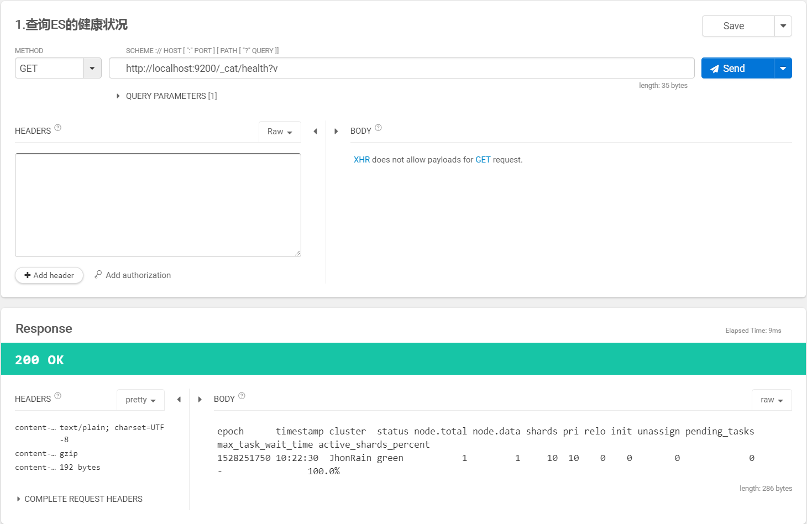

* 2.查看集群中存在哪些索引
> Type：GET

> URL: http://localhost:9200/_cat/indices?v
```json
无
```


* 3.创建测试索引（es-learn-demo）
> Type: PUT

> URL: http://localhost:9200/es-learn-demo?pretty
```json
无
```


* 4.查看创建之后的索引记录
> Type: GET

> URL: http://localhost:9200/_cat/indices?v
```json
无
```
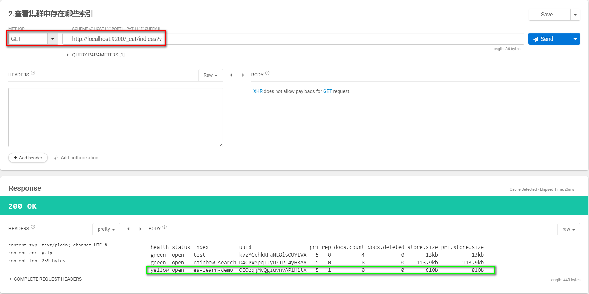

* 5.创建索引记录es-product-learn的类型记录1
> Type: PUT

> URL: http://localhost:9200/es-product-learn/toothpaste/1
```json
{
  "name":"中华牙膏",
  "desc":"中华牙膏",
  "price":30,
  "producer":"中华producer",
  "tags":["美白","防蛀"]
}
```
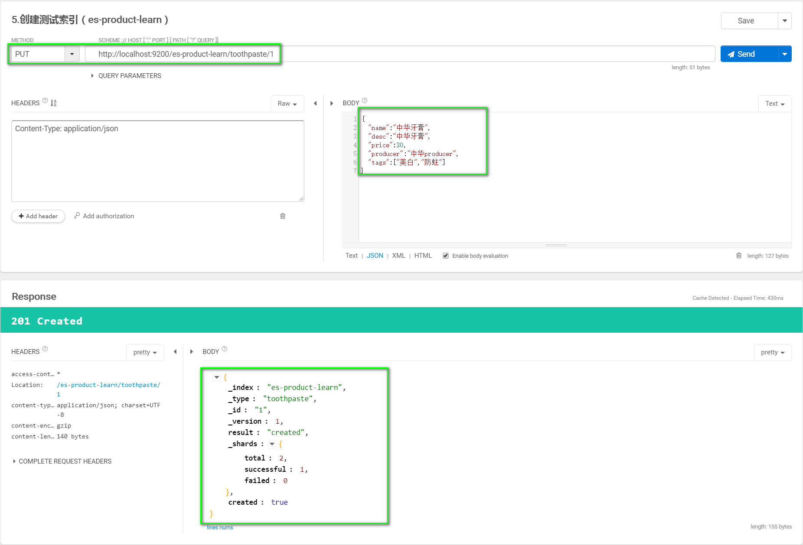

* 6.创建索引记录es-product-learn的类型记录2
> Type: PUT

> URL: http://localhost:9200/es-product-learn/toothpaste/2
```json
{
  "name":"高露洁牙膏",
  "desc":"高露洁牙膏",
  "price":40,
  "producer":"高露洁producer",
  "tags":["美白","防蛀"]
}
```


* 7.查询索引信息
> Type: GET

> URL: http://localhost:9200/es-product-learn/toothpaste/2
```json
无
```


* 8.更新索引POST方式（针对某一个字段更新）
> Type: POST

> URL: http://localhost:9200/es-product-learn/toothpaste/2/_update
```json
{
  "doc":{
    "name":"高露洁牙膏（修改1）"  
  }
}
```
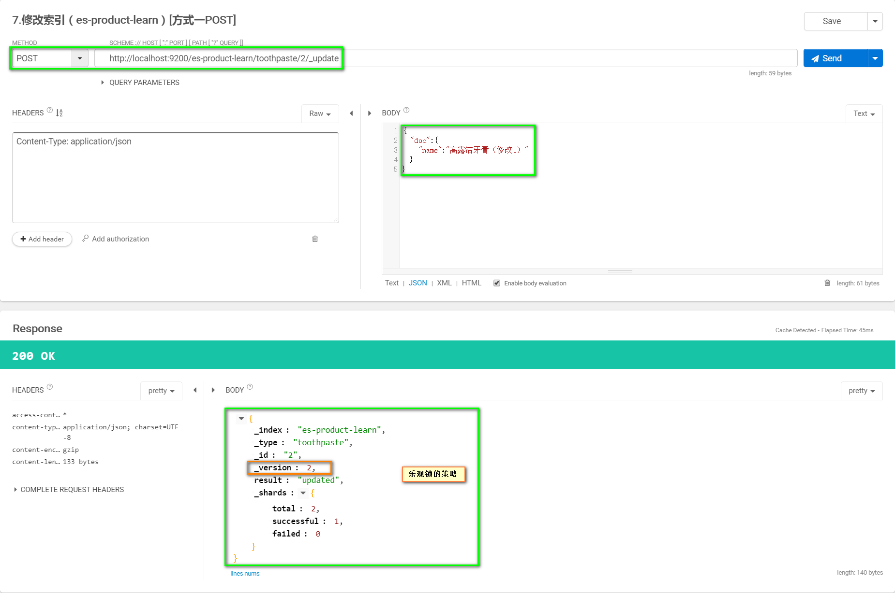

* 9.查询更新后的记录
> Type: PUT

> URL: http://localhost:9200/es-product-learn/toothpaste/2
```json
无
```
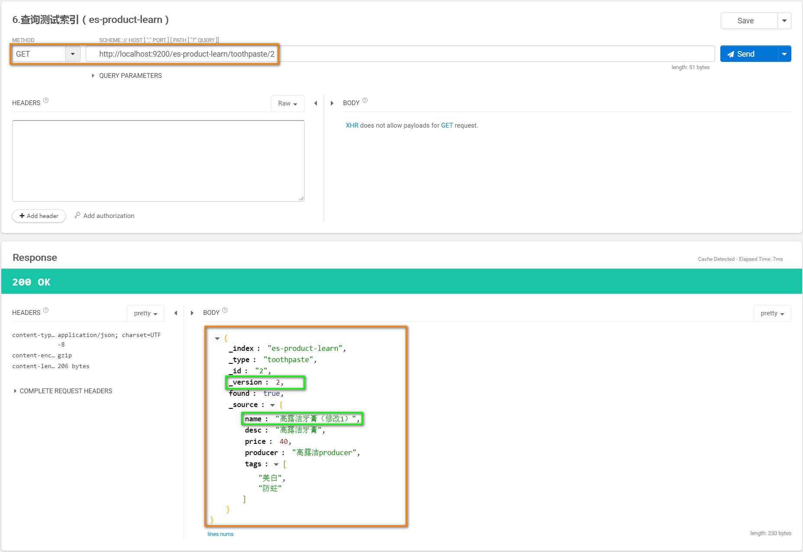

* 10.更新索引PUT方式（需要完整的数据结构）
> Type: PUT

> URL: http://localhost:9200/es-product-learn/toothpaste/2
```json
{
  "name":"高露洁牙膏[PUT更新]",
  "desc":"高露洁牙膏",
  "price":50,
  "producer":"高露洁producer",
  "tags":["美白","防蛀"]
}
```


* 11.查询所有es-product-learn下牙膏类型的所有记录
> Type: GET

> URL: http://localhost:9200/es-product-learn/toothpaste/_search
```json
无
```
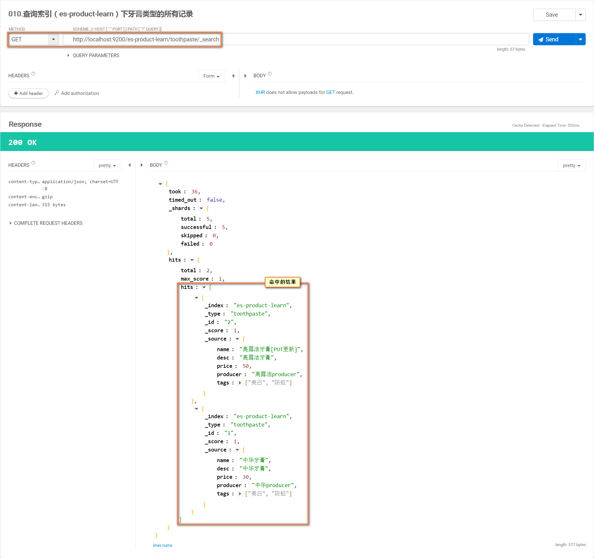

* 12.查询索引（es-product-learn）下牙膏的名称并且按照价格排序
> Type: GET

> URL: http://localhost:9200/es-product-learn/toothpaste/_search?q=name:牙膏&sort=price:desc
```json
无
```
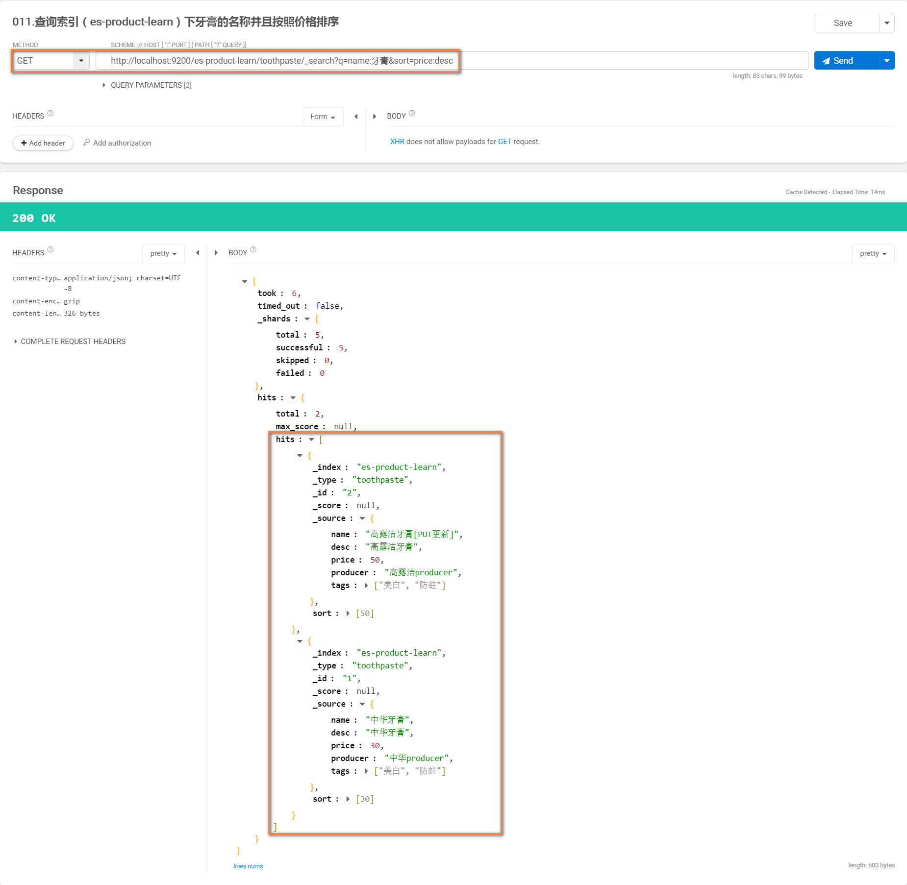

* 13.DSL-match_all(es-product-learn-toothpaste中的所有记录)
> Type: POST

> URL: http://localhost:9200/es-product-learn/toothpaste/_search
```json
TODO
```
.png)

* 14.DSL-Match(查询名称包含牙膏&价格降序排序)
> Type:

> URL:
```json
{
  "query":{
    "match_all":{}
  }
}
```
.png)

* 15.DSL-Page-Query-MatchAll(分页查询)
> Type: POST

> URL: http://localhost:9200/es-product-learn/_search
```json
{
  "query":{
    "match_all":{}
  },
  "from":0,
  "size":1
}
```
.png)

* 16.DSL-Specification-field-Query
> Type: POST

> URL: http://localhost:9200/es-product-learn/toothpaste/_search
```json
{
  "query":{
    "match_all":{}
  },
  "_source":["name","price"]
}
```


* 17.DSL添加过滤条件（Filter-Info）
> Type: POST

> URL: http://localhost:9200/es-product-learn/toothpaste/_search
```json
{
  "query":{
    "bool":{
      "must":{
        "match":{
          "name":"牙膏"
        }
      },
      "filter":{
    	"range":{
    		"price":{
    			"gt":35
    		 }
  		}
      } 
    }
  }
}
```
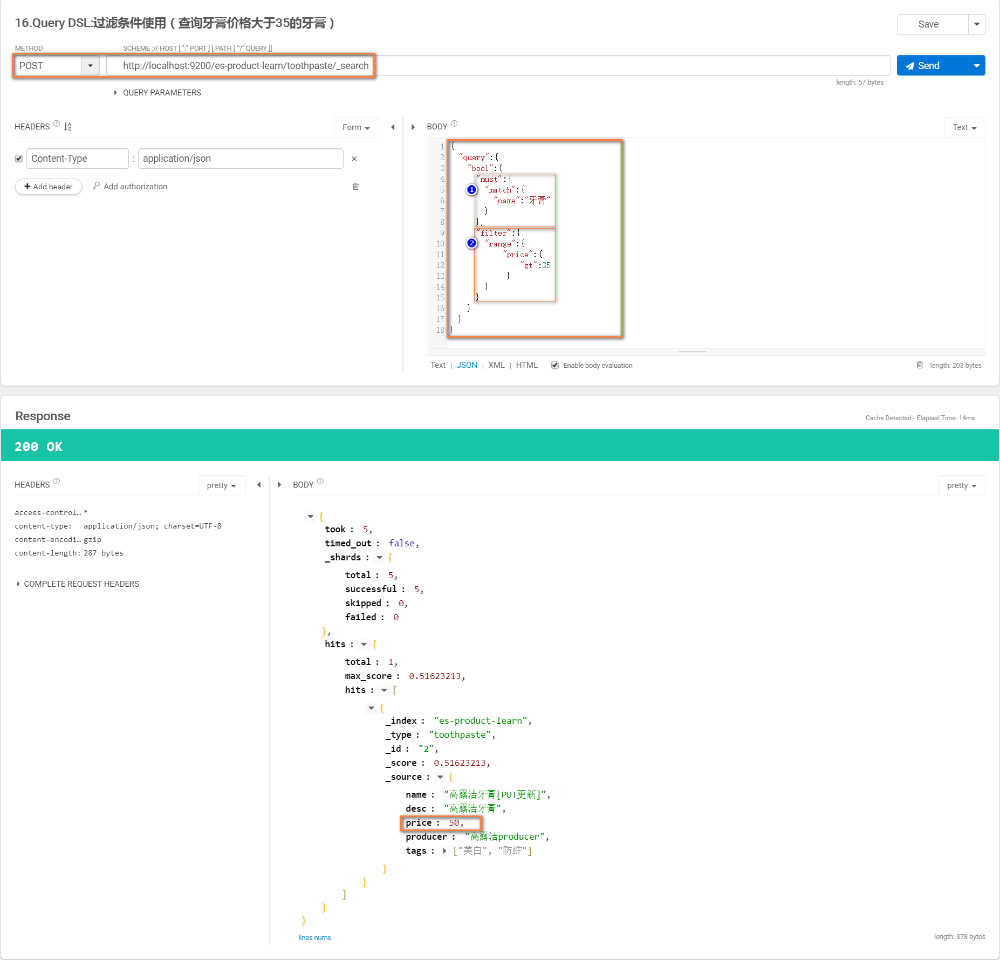

* 18.DSL全文检索查询记录
> Type: POST

> URL: http://localhost:9200/es-product-learn/toothpaste/_search
```json
{
  "query":{
    "match":{
      "producer":"高露洁producer"
    }
  }
}
```


* 19.DSL短语检索查询记录
> Type: POST

> URL: http://localhost:9200/es-product-learn/toothpaste/_search
```json
{
  "query":{
    "match_phrase":{
      "producer":"中华producer"
    }
  }
}
```
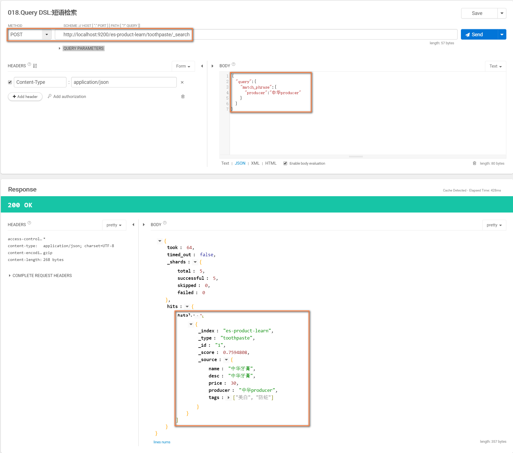

* 20.DSL高亮检索记录
> Type: POST

> URL: http://localhost:9200/es-product-learn/toothpaste/_search
```json
{
  "query":{
    "match":{
      "producer":"producer"
    }
  },
  "highlight":{
    "fields":{
      "producer":{}
    }
  }
}
```


* 21.DSL聚合查询报错
> Type: POST

> URL: http://localhost:9200/es-product-learn/toothpaste/_search
```json
{
  "size":0,
  "aggs":{
    "agg_by_tag":{
      "terms":{
        "field":"tags"
      }
    }
  }
}
```


* 22.DSL聚合报错解决（修改tags字段的属性）
> Type: PUT

> URL: http://localhost:9200/es-product-learn/_mapping/toothpaste
```json
{
  "properties":{
    "tags":{
      "type":"text",
		"fielddata": true
    }
  }
}
```


* 23.DSL聚合查询结果（通过tags进行聚合）
> Type: POST

> URL: http://localhost:9200/es-product-learn/toothpaste/_search
```json
{
  "size":0,
  "aggs":{
    "agg_by_tag":{
      "terms":{
        "field":"tags"
      }
    }
  }
}
```
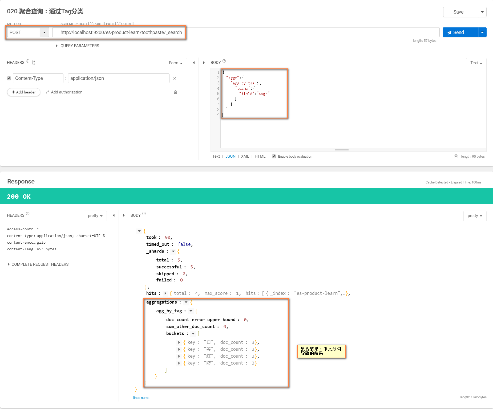

* 24.DSL检索（附加查询条件）
> Type: POST

> URL: http://localhost:9200/es-product-learn/_search
```json
{
  "size":0,
  "query":{
    "match":{
      "name":"group"
    }
  },
  "aggs":{
  	"agg_by_tags":{
  		"terms":{"field":"tags"}
		}
	}
}
```
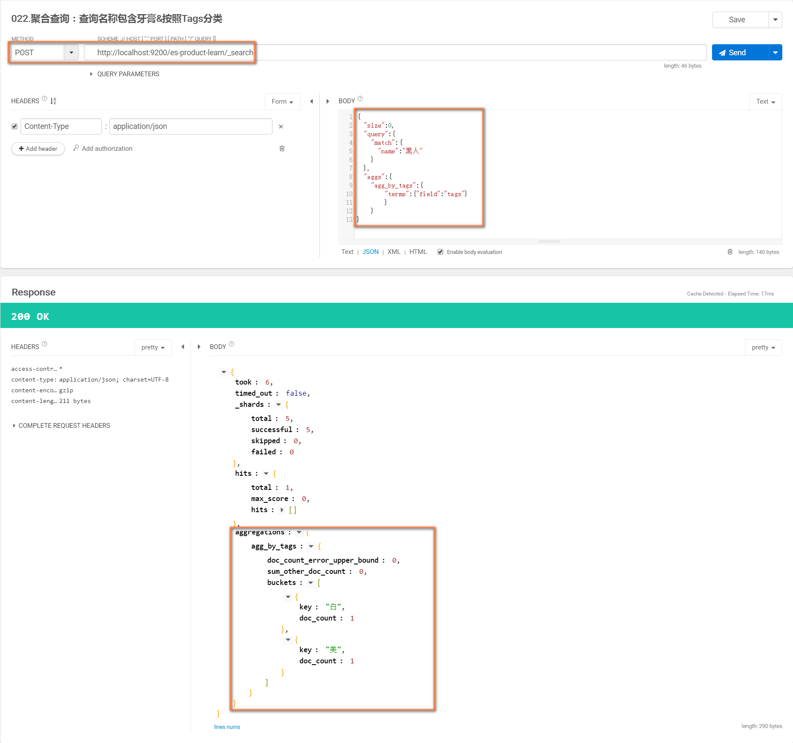

* 25.DSL检索（查询每个tags下的商品的平均价格）
> Type: POST

> URL: http://localhost:9200/es-product-learn/toothpaste/_search
```json
{
  "size":0,
  "query":{
    "match":{
      "name":"group"
    }
  },
  "aggs":{
    "agg_by_tags":{
      "terms":{
        "field":"tags"
      },
      "aggs":{
        "avg_price":{
          "avg":{
            "field":"price"
          }
        }
      }
    }
  }
}
```
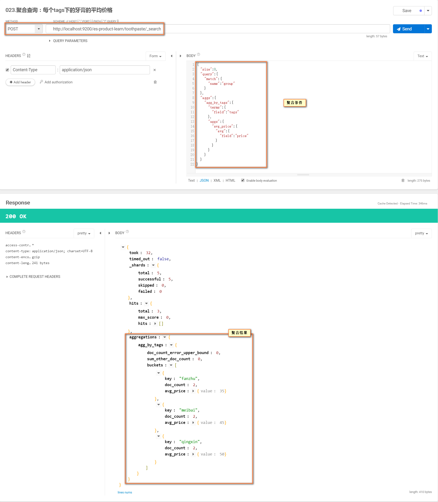

* 26.DSL检索（查询每个tags下的商品的平均价格并且排序）
> Type: POST

> URL: http://localhost:9200/es-product-learn/toothpaste/_search
```json
{
  "size":0,
  "query":{
    "match":{
      "name":"group"
    }
  },
  "aggs":{
    "agg_by_tags":{
      "terms":{
        "field":"tags",
        "order":{
          "avg_price":"desc"
        }
      },
      "aggs":{
        "avg_price":{
          "avg":{
            "field":"price"
          }
        }
      }
    }
  }
}
```
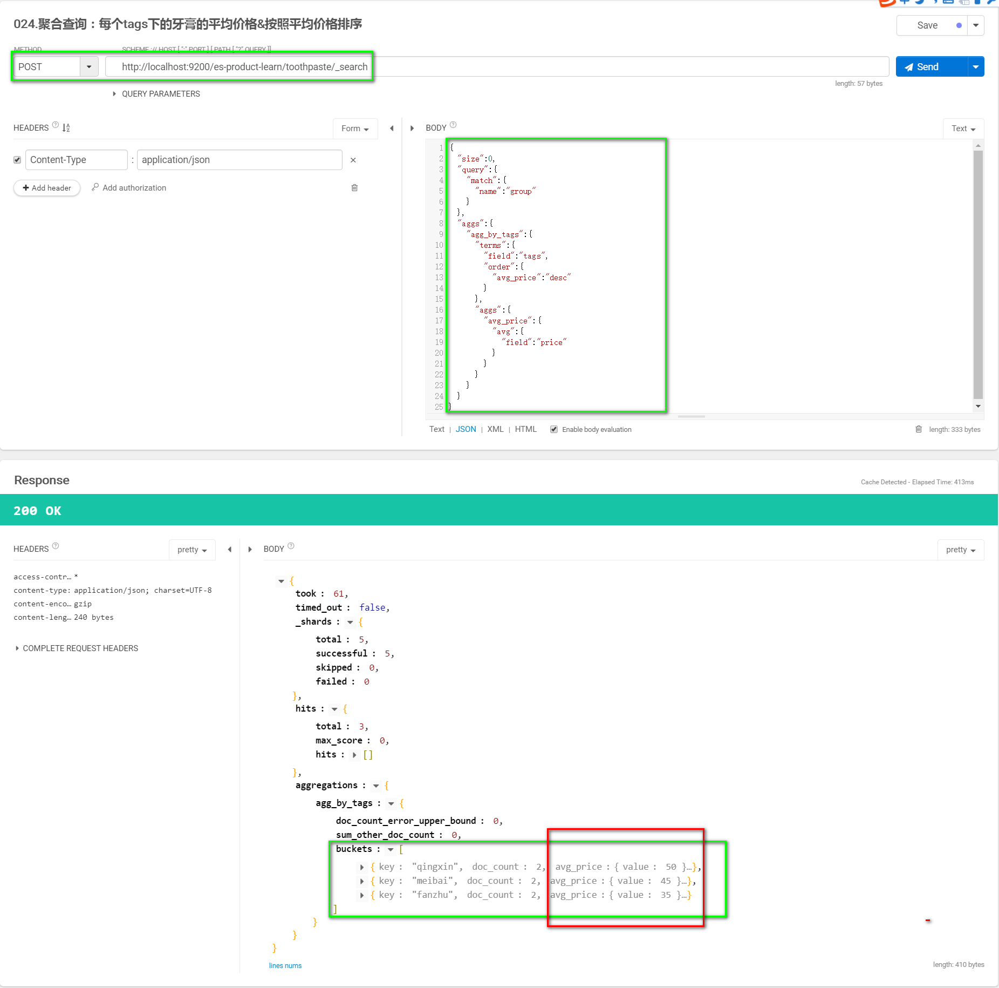

* 27.DSL复合检索条件（价格区间分组_标签分组_平均价格）
> Type: POST

> URL: http://localhost:9200/es-product-learn/_search
```json
{
	"query": {
		"match": {
			"name": "group"
		}
	},
	"aggs": {
		"agg_by_price": {
			"range": {
				"field": "price",
				"ranges": [{
					"from": 0,
					"to": 20
				}, {
					"from": 20,
					"to": 40
				}, {
					"from": 40,
					"to": 80
				}]
			},
			"aggs": {
				"agg_by_tag": {
					"terms": {
						"field": "tags",
						"order": {
							"avg_price": "desc"
						}
					},
					"aggs": {
						"avg_price": {
							"avg": {
								"field": "price"
							}
						}
					}
				}
			}
		}
	}
}
```


