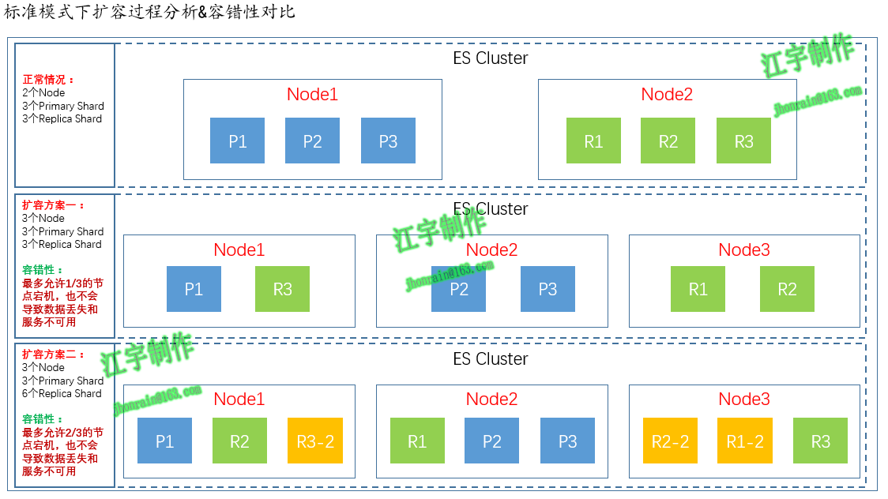

### Elasticsearch扩容机制
* 垂直扩容
    > 采购更强大的服务器，成本非常高昂，而且会有瓶颈，假设世界上最强大的服务器容量就是10T，但是当你的总数据量达到5000T的时候，你要采购多少台最强大的服务器啊
* 水平扩容
    > 业界经常采用的方案，采购越来越多的普通服务器，性能比较一般，但是很多普通服务器组织在一起，就能构成强大的计算和存储能力

* Elasticsearch的扩容对应用程序的透明性
    * 水平扩容机制

* Elasticsearch标准集群模式下的扩容过程分析和容错性对比

