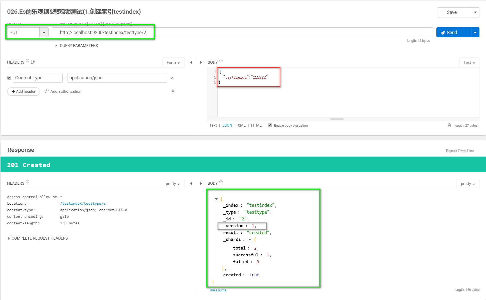
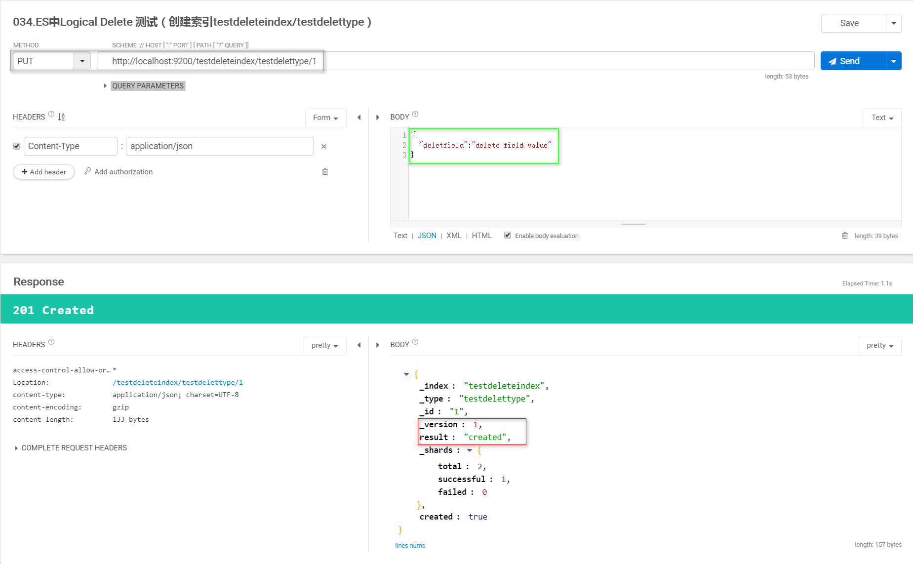
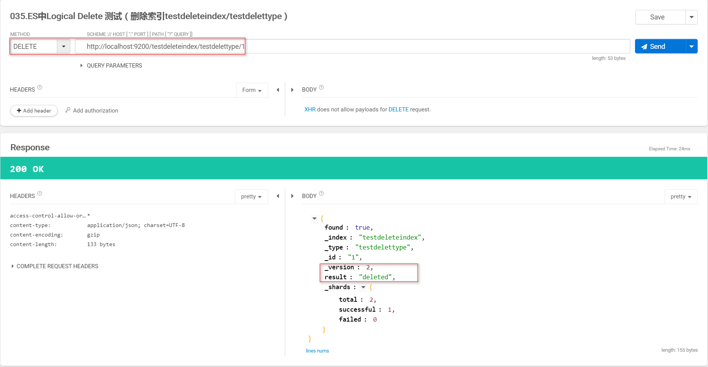
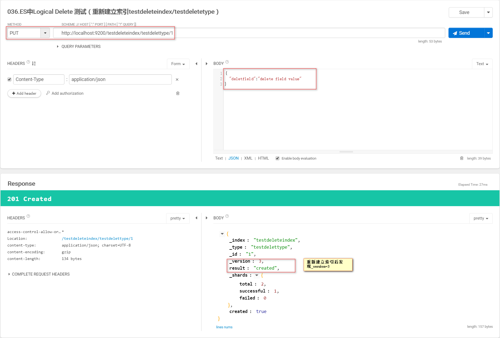

### Elasticsearch的并发控制锁机制

* _version元数据
> Method : PUT

> URL : http://localhost:9200/testindex/testtype/1

> Params :
```json
{
  "testfield":"333333"
}
```
> Result:
```json
{
	"_index": "testindex",
	"_type": "testtype",
	"_id": "3",
	"_version": 1,
	"result": "created",
	"_shards": {
		"total": 2,
		"successful": 1,
		"failed": 0
	},
	"created": true
}
```

说明：第一次创建一个document的时候，它的_version=1;以后每次对这个document执行修改或者**删除**操作，都会对这个_version版本号进行自增+1。

* 并发控制（乐观锁）--基于_version更新
    * 创建索引
    
    * Client One 基于version=1更新操作
    
    * 并发情况下，Client Two 基于version=1更新操作（异常）
    
    * Client Two 基于最新的version=2更新操作（正常）
    

* 并发控制（乐观锁）--基于version_type=external更新
    * 创建索引
    
    * Client One 更新操作
    
    * Client Two 更新操作（异常）
    
    * Client Two 更新操作（正常）
    
    
* _version=xx 和_version=xx&version_type=external 的区别
    * _version=xx，只有当你提供的version与es中的_version一模一样的时候，才可以进行修改，只要不一样，就报错；
    * _version=xx&version_type=external的时候，只有当你提供的version比es中的_version大的时候，才能完成修改
    * 举例：
        * es，_version=1，?version=1，才能更新成功
        * es，_version=1，?version>1&version_type=external，才能成功，比如说?version=2&version_type=external

* document的删除机制
    在删除一个document之后，再次重新创建这条document,ES会在delete version基础上，再把version=version+1
    * 创建索引
    
    * 删除索引
    
    * 重新建立索引
    

