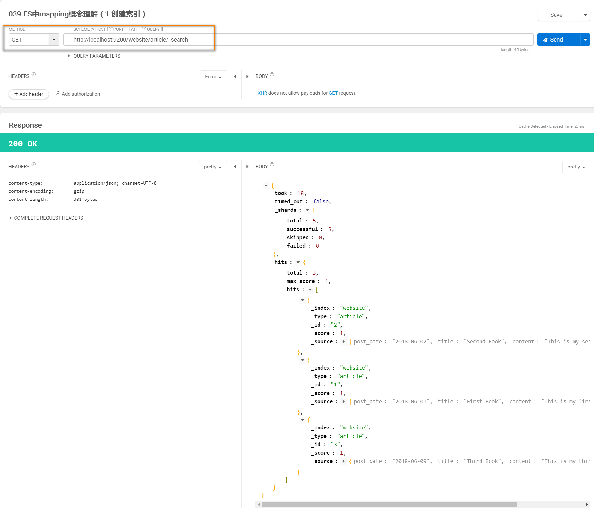
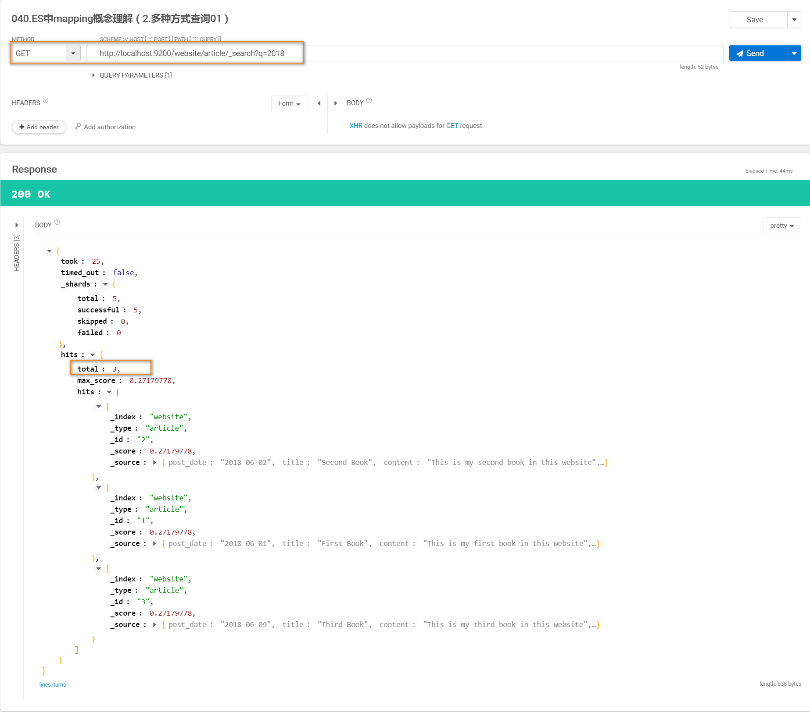
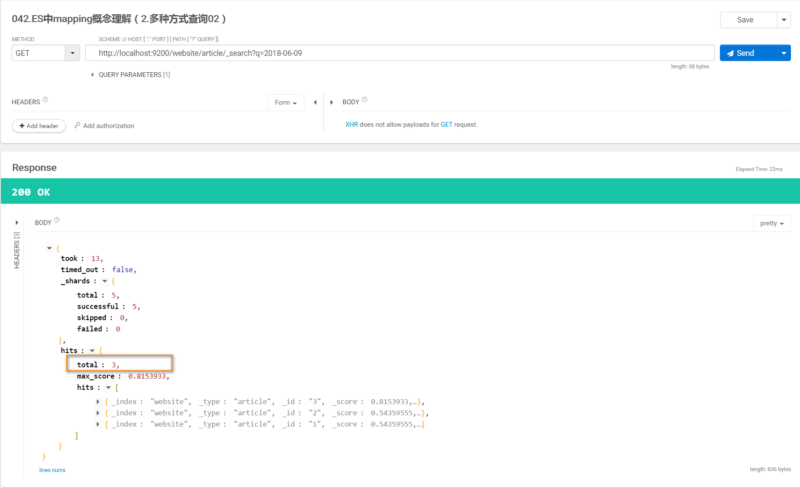
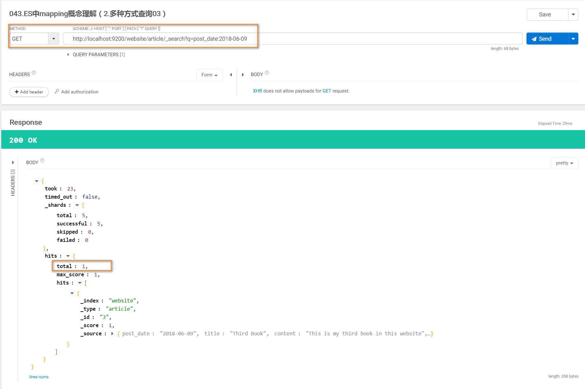
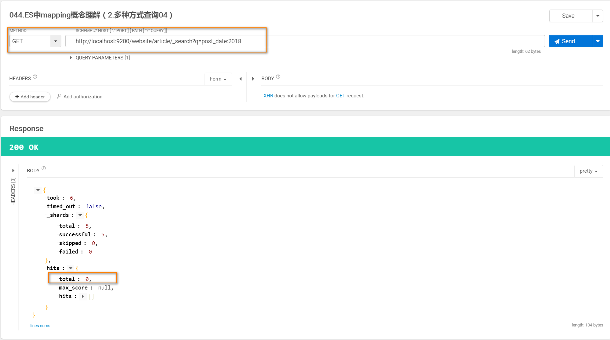
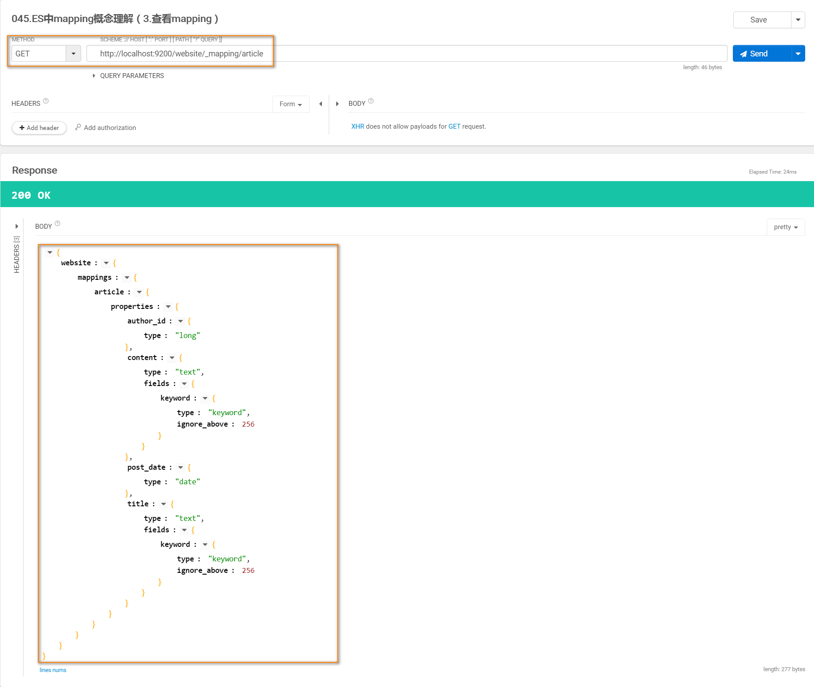

### Elasticsearch中mapping的概念

* 创建测试数据(ES自动生成mapping)
    * PUT /website/article/1
        ```json
        {
          "post_date": "2018-06-01",
          "title": "First Book",
          "content": "This is my first book in this website",
          "author_id": 11400
        }
        ```
    * PUT /website/article/2
        ```json
        {
          "post_date": "2018-06-02",
          "title": "Second Book",
          "content": "This is my second book in this website",
          "author_id": 11400
        }
        ```
    * PUT /website/article/3
        ```json
        {
          "post_date": "2018-06-09",
          "title": "Third Book",
          "content": "This is my third book in this website",
          "author_id": 11400
        }
        ```
    * 查看结果
    
    
* 搜索
    * GET /website/article/_search?q=2018
    
    * GET /website/article/_search?q=2018-06-09
    
    * GET /website/article/_search?q=post_date:2018-06-09
    
    * GET /website/article/_search?q=post_date:2018
    
    
* 查看ES自动建立的Mapping
    * 查询
    
    * 结果
    ```json
    {
    	"website": {
    		"mappings": {
    			"article": {
    				"properties": {
    					"author_id": {
    						"type": "long"
    					},
    					"content": {
    						"type": "text",
    						"fields": {
    							"keyword": {
    								"type": "keyword",
    								"ignore_above": 256
    							}
    						}
    					},
    					"post_date": {
    						"type": "date"
    					},
    					"title": {
    						"type": "text",
    						"fields": {
    							"keyword": {
    								"type": "keyword",
    								"ignore_above": 256
    							}
    						}
    					}
    				}
    			}
    		}
    	}
    }
    ```